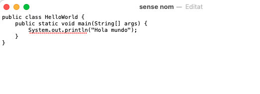
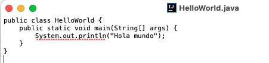
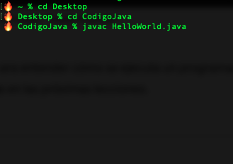
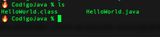
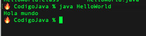

## Primer programa Java usando textEdit (bloc de notas en Windows) y la Terminal

Antes de empezar a trabajar en un entorno de desarrollo integrado (IDE) en mi caso IntelliJ IDEA, vamos a aprender cómo se escribe y se ejecuta un programa sencillo en Java. usando textEdit y la Terminal.

### **¿Qué significa que Java es un lenguaje de dos etapas?**

Java procesa el código fuente en dos fases principales:

1. **Compilación:** El código fuente escrito en Java se convierte en "bytecode", que es un tipo de código intermedio que no es legible directamente por los humanos.

2. **Ejecución:** El bytecode es ejecutado por el intérprete de la Máquina Virtual de Java (JVM), que lo convierte en lenguaje máquina, permitiendo que el programa se ejecute.

### **Pasos para crear y ejecutar un programa en Java**

1. **Abrir textEdit:** Inicia textEdit en tu ordenador.
2. **Escribir el código del programa:**
Vamos a escribir un programa que muestre el mensaje "Hola mundo" en la pantalla. Aquí está el código que debes escribir en textEdit:

3. **Guardar el archivo:**
   - Guarda el archivo con el nombre **`HelloWorld.java`**. Es importante que el nombre del archivo coincida exactamente con el nombre de la clase **`HelloWorld`** y que uses la extensión **`.java`**.
   - Guarda este archivo en una carpeta específica, por ejemplo, en una carpeta llamada "CodigoJava".

4. **Compilar el programa**
   - Abre la Terminal.
   - Navega hasta la carpeta donde guardaste tu archivo usando comandos como cd. Por ejemplo: cd CodigoJava.

   - Escribe el siguiente comando para compilar tu programa `javac HelloWorld.java` El comando `javac`compila archivos fuente Java en bytecode, facilitando la ejecución del programa en cualquier sistema con JVC.
   
     
   
   - Si todo está correcto, este comando creará un archivo llamado `HelloWorld.class`, que contiene el bytecode de tu programa. Para comprobar que se ha creado bien, podemos usar el comando `ls`y ver el contenido de la carpeta. 
   
     
   
5. **Ejecutar el programa**
   - Ahora, en la misma línea de comandos, ejecuta tu programa con el comando `java HelloWorld` El comando `java`ejecuta programas Java compilados, iniciando la JVM y cargando el bytecode para su ejecución.
   - Aparece en pantalla el mensaje "Hola Mundo"
   
     
   

