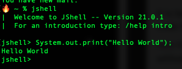
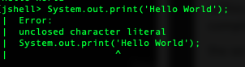
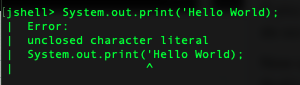
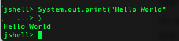
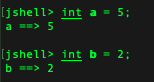
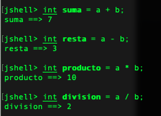

# Nuestro primer programa usando JShell

## Introducción
JShell es una consola interactiva de Java. Se usa principalmente para experimentación y prototipado rápido dre fragmentos de código Java sin necesidad de crear un programa completo con una clase y método `main`

## Funcionalidades Clave de JShell
1. **Ejecución Inmediata de Código:** Permite a los usuarios ejecutar instrucciones de Java y obtener resultados inmediatos. Esto es ideal para aprender Java y experimentar con nuevas características del lenguaje.


2. **Feedback Instantáneo:** JShell proporciona feedback inmediato sobre el código que escribes. Puedes probar métodos, declaraciones y expresiones al vuelo, y ver los resultados o errores directamente.


3. **Desarrollo Iterativo:** Facilita la escritura de código de manera iterativa. Puedes definir variables, escribir métodos, y luego modificarlos y reutilizarlos sin reiniciar la sesión.


4. **Soporte para Definiciones de Variables, Métodos y Clases:** Aunque es una shell, permite definir variables, métodos y clases completas dentro del entorno, y todas estas definiciones son inmediatamente accesibles y modificables.


5. **Importación Automática de Paquetes Comunes:** JShell importa automáticamente paquetes comúnmente usados (como java.util.* y java.io.*), lo que simplifica las pruebas y reduce la necesidad de escribir importaciones explícitas.


## Reglas Básicas para Desarrollar en Java
Antes de comenzar a escribir código Java, es importante recordar las reglas de cómo desarrollar un programa en Java:
- Java es sensible a mayúsculas y minúsculas, por lo tanto, hay que tener cuidado al usar palabras clave, variables y nombres de métodos.
- Cada instrucción en Java debe terminar con un punto y coma `;`.
- Java utiliza llaves `{}` para agrupar bloques de código.
- Java es un lenguaje de programación orientado a objetos, por lo que todo el código está organizado en clases.
- Cada clase debe tener un nombre único y debe guardarse en un archivo separado con el mismo nombre que la clase, seguido por la extensión `.java`.
- Todo programa Java debe tener un método principal `main`, que es el punto de entrada del programa. La firma del método principal es:
  ```java
  public static void main(String[] args)

## Convenios de Nombres y Comentarios
- Java utiliza camel case para las convenciones de nombres, lo que significa que la primera letra de cada palabra en un identificador de varias palabras se capitaliza, excepto la primera palabra, que es completamente en minúsculas.

- Java utiliza el símbolo de doble barra `//` para iniciar un comentario de una sola línea y los símbolos `/*` y `*/` para iniciar y finalizar un comentario de múltiples líneas. Los comentarios ayudan a documentar el código, facilitando su comprensión para otros desarrolladores o incluso para uno mismo en el futuro.

## Usando JShell
Cuando escribimos código en JShell, solo nos permite escribir y ejecutar fragmentos de código Java y expresiones, que son pequeñas piezas de código. Por ejemplo, podemos ejecutar el siguiente fragmento sin necesidad de definir una clase completa:
`System.out.println("Hola Mundo");`
Este comando le indica a Java que imprima "Hola Mundo" en la pantalla.

### Hola Mundo con JShell
Para empezar a usar JShell, tenemos que abrir la terminal y escribir `jshell`
Si escribimos `System.out.print("Hello World");`Nos aparecerá "Hello World" 



Es importante recordar que cuando escribimos una String, el texto tiene que ir entre comillas dobles `"` y usamos comillas simples `'` nos dará el siguiente error:



Si no cerramos las comillas, nos dará el siguiente error:



Si no cerramos la línea de código con `;` JShell pensará que no hemos acabado.



### Pequeño programa con JShell

Ahora que tenemos "Hello Word" dominado, vamos a ir un paso más allá. Hablaremos más adelante de los tipos de datos que tenemos en Java, usaremos el tipo `int` para este programa. Los `int` (de integer) son números enteros, es decir, que no tienen decimales. 

Las variables tienen la característica que podemos cambiar su valor (por el contrario, las constantes no). Definiremos una variable `a` a la que le asignaremos el valor 5 y otra variable `b`a la que asignaremos el valor 2.



Crearemos las varibles `suma` `resta` `producto` `division` y le asignaremos como valor el resultado de operar con las variables `a` y `b`

