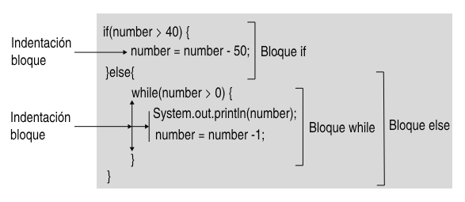

## Estructura básica de un programa

Java es un lenguaje pensado para el paradigma de la programación
orientada a objetos (POO). 

Es por ello que algunos elementos de POO
aparecen cuando analizamos el código mínimo para crear un programa en Java

```java
public class className {
    public static void main(String[] args) {
        // TODO: aquí va el código
        
    }
    //  TODO: aquí podría ir más código en forma de funciones (también conocidos como métodos)
}
```

Analicemos el código anterior

1) Como Java está orientado a objetos, los programas en Java están organizados por clases. **Cada clase tiene que estar en un fichero que se llame igual que la clase.** Por convención de nombres, lo más habitual es que la primera letra de cada palabra que compone el nombre de la clase, empiece por mayúscula. En el ejemplo, la clase se llama ```ClassName``` y el fichero se llama ```ClassName.java```


2) Un programa de una cierta envergadura, estará formado por más de una clase (por ejemplo, más de un fichero .java). Es por eso que como mínimo en una de estas clases, habrá un método especial llamado ```main```. Este método sirve como punto de entrada al programa. El programa se iniciará cuando se llame a dicho método. El método ```main``` tiene una nomenclatura concreta:

    ```java
    public static void main(String[] args) {
   }
   ```
3) El método ```main``` no devueve nada (es por eso que su tipo de retorno es void) y recibe un array de Strings (una cadena de carácteres) como parámetros, llamado args (el nombre se puede cambiar, pero es habitual llamarlo así, es la abreviatura de arguments). Este parámetro ```args``` almacena los valores que se pasan por línea de comando (los argumentos) cuando se ejecuta el programa. Como en el código anterior, el método ```main``` se encuentra en la clase ```ClassName``` y haremos:

    
```java ClassName David 36```
4) En este caso, ```args``` tendría dos casillas con los valores "David" y "36", los dos serían de tipo String. El primer valor estaría en args[0] y el segundo en args[1]


5) Por el momento, nos olvidaremos de la palabra reservada ```static``` Más adelante, hablaremos de esto.


6) A continuación de los comentarios en los que pone "TODO" podríamos escribir el código de nuestro programa. El código del primer "TODO" está formado por instrucciones/sentencias (statements) y bloques (blocks)

    - **Instrucción/sentencia**: Es la unidad mínima de programación encargada de realizar una acción. Cada sentencia tiene que acabar en un punto y coma (;)
    ```java
    int number = 50; // declara una variable de tipo int llamada number y
   // la inicializa con el valor 50
   number = number * 3; // multiplica por 3 el valor de number y asigna 
   // el nuevo valor a number
   Ststem.out.println(number); //imprime por pantalla el valor de number
   ```
    - **Bloque**: Es un grupo de sentencias agrupadas entre llaves {}. Todas las sentencias situadas entre las dos llaves se tratan como una única unidad. Dentro de las dos llaves es posible que no haya ninguna instrucción.
      
   
7) Cuando escribimos nuestro código tenemos que tener presentes algunas convenciones de estilo:

   - No importa añadir varios espacios en blanco, tabuladores, enters, entre palabras, ya que Java los trata como un único espacio/tabulador/línea nueva.
   - Es importante indentar (sangrar) el código con tabuladores y espacios en blanco, así como usar de manera adecuada los espacios en blanco entre líneas para facilitar la lectura del código.
   - En el caso de las llaves, lo más habitual en Java es poner la primer llave { al final de la primera línea. En el caso de la última llave } se pone en una línea posterior a la última sentencia y alineada con la primera sentencia del bloque.