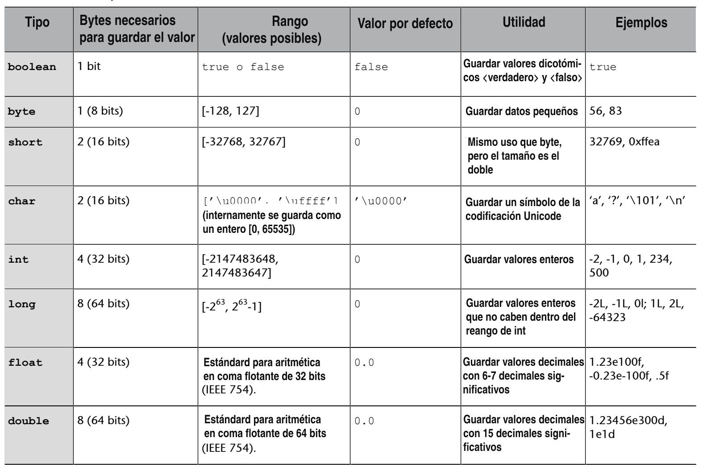

## 5. Variables
Una **variable** se define como una unidad básica de almacenaje. Podemos entenderla como una etiqueta que permite guardar y recuperar un dato de memória. Este dato será de un tipo. Una variable tendrá un nombre y un tipo y guardará un valor.

Se llama *variable* porque el valor que almacena puede variar durante la ejeccución del programa.

### 5.1 Nombre
Los nombres de las variables tienen que ser representativos que eso que representan.

Cuando asignamos un nombre a una variable tenemos que tner en cuenta que:

- Los nombres de las variables son *case-sensible*. Java distingue entre minúsculas y mayúsculas, es por esto que numPeople y numpeople no son la misma variable. 
- El nombre de una variable tiene que empezar por una letra, o con el símbolo $, o con el símbolo *underscore _*. Lo habitual, por eso, es que las variables empiecen con una letra.
- El nombre de una variable puede tener cualquier longitud y, a partir de la primera letra, puede estar formada por cualquier combinación de letras Unicode, dígitos y los símbolos $ y *underscore* _
- Para escribir el nombre de una varibale en Java se sigue la convención **lower camel case**. Esta convención indica que la primera palabra se escribe en minúcula y, si el nombre de la variable está compuesta por dos o más palabras, a partir de la segunda palabra, la primera letra de ellas se escribe en mayúscula.
- El nombre que se asigna a una variable no puede conincidir con uno de los literales siguientes: ```true, false y null``` 
- Tampoco se pueden utilizar como nombres de variables algunas de las palabras siguientes reservadas de Java (*keywords*):

```
abstract   continue   for          new         switch
assert     default    goto         package     synchronized
boolean    do         if           private     this
break      double     implements   protected   throw
byte       else       import       public      throws
case       enum       instanceof   return      transient
catch      extends    int          short       try
char       final      interface    static      void
class      finally    long         strictfp    volatile
const      float      native       super       while
```
### 5.2 Tipo
Como hemos comentado, las variables serán de un tipo. En Java, hay dos tipos: primitivos y referencias. Los **primitivos** (o básicos) sirven para almacenar valores sencillos, mientras que las **referencias** se utilizan para guardar elementos complejos, como ahora los objetos de una clase. 

**Primitivos**
En Java hay ocho tipos de primitivos/básicos.



**Unicode** 
El código Unicode es un estándard de la informática para representar texto. Incluye alfabetos, símbolos y elementos especiales.

Para declarar una variable seguiremos uno de los patrones siguientes (y combinaciones de ellos):

```
type nameVari


