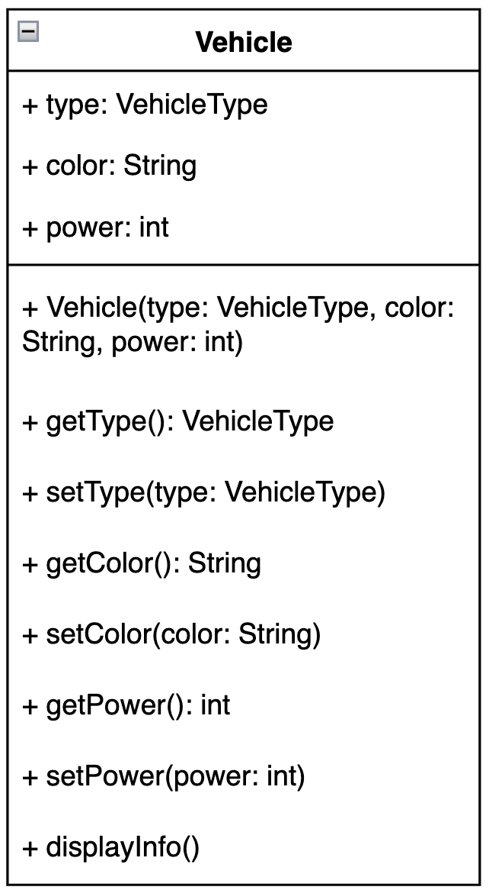
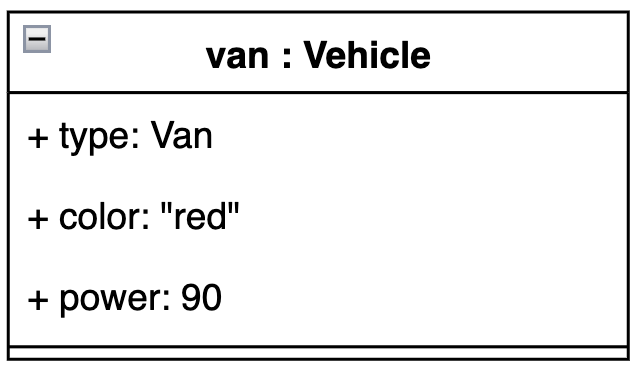

- [Introducción a la Programación Orientada a Objetos](#introducción-a-la-programación-orientada-a-objetos)
- [Definición de Módulo](#definición-de-módulo)
- [Transición a la Programación Orientada a Objetos](#transición-a-la-programación-orientada-a-objetos)
- [Beneficios de la Programación Orientada a Objetos](#beneficios-de-la-programación-orientada-a-objetos)
- [Programación Orientada a Objetos](#programación-orientada-a-objetos)
- [Ejemplo de Clase](#ejemplo-de-clase)
- [Descripción de la Clase Vehicle](#descripción-de-la-clase-vehicle)
  - [Atributos](#atributos)
  - [Métodos](#métodos)
- [Planteamiento del problema y resolución](#planteamiento-del-problema-y-resolución)
- [Ejercicio](#ejercicio)

## Introducción a la Programación Orientada a Objetos

Antes de hablar de programación orientada a objetos, tenemos que hablar de la programación estructurada.

Este tipo de programación está basado en un enfoque descendiente (top-down) para diseñar problemas complejos. Se caracteriza por diseñar pequeños subprogramas más sencillos, en los que se divide el programa principal. Cada subproblema, se puede descomponer en programas más sencillos/pequeños. Por lo que podemos entender cada subproblema como un problema individual.

El enfoque top-down, implica tener diferentes niveles de descomposición que van del más general (el inicial) al más particular (el subproblema más pequeño).

Podemos decir que si el problema complejo inicial, es el programa, los subproblemas, son subprogramas. Los subprogramas del primer nivel de descomposición se llaman módulos. Los niveles posteriores (subprogramas) están formados por funciones y acciones. 

Definimos un **módulo** una colección que agrupa constantes, variables, funciones y acciones que se relacionan entre ellas. 

### Transición a la Programación Orientada a Objetos

A diferencia de la programación estructurada que se centra en funciones y procedimientos, la programación orientada a objetos se basa en el concepto de "objetos", que son entidades que combinan estado (datos) y comportamiento (funciones o métodos). Esta metodología se basa en varios principios clave:

#### Encapsulamiento

El encapsulamiento es la práctica de mantener juntos los datos (atributos) y los métodos que manipulan esos datos, protegiendo partes del objeto para evitar que el estado interno sea alterado de manera inesperada. Esto se logra mediante el uso de modificadores de acceso que definen claramente lo que es accesible desde fuera del objeto.

#### Herencia

La herencia permite que una clase derive de otra clase, "heredando" sus métodos y atributos. Esto facilita la reutilización de código y la creación de jerarquías de objetos más generales a más específicos.

#### Polimorfismo

El polimorfismo permite que los objetos sean tratados como instancias de una clase base, pero que respondan a las mismas operaciones de maneras diferentes. Esto se logra mediante el uso de la sobrecarga de métodos (misma función, diferentes parámetros) y la sobreescritura de métodos (mismo método, diferente comportamiento en clases derivadas).

#### Abstracción

La abstracción se refiere a la capacidad de concentrarse en las características esenciales de un aspecto del mundo real, ignorando las que son menos importantes. Esto se hace definiendo clases abstractas y métodos que deben implementarse en clases derivadas.
Los lenguajes de programación orientados a objetos, fuerzan al programador a centrarse en el problema que tiene que resolver, en vez de pensar si tiene que usar un if, un if-else... El programador dedica más tiempo pensando en el diseño del código y esto provoca que sea un desarrollo más productivo y de más calidad.

### Beneficios de la Programación Orientada a Objetos

1. **Modularidad**: El origen de la encapsulación promueve la modularidad del código. Los objetos son independientes y pueden ser desarrollados y probados de manera aislada.
2. **Mantenibilidad**: Debido a la herencia y el polimorfismo, una vez que un objeto está probado, puede reutilizarse en sistemas futuros, y los cambios realizados en clases base pueden propagarse.
3. **Escalabilidad**: Los principios de POO facilitan la escalación de proyectos grandes, permitiendo a los desarrolladores manejar más fácilmente la complejidad del software.
4. **Reutilización**: Favorece la reutilización del código en otros programas, haciendo uso de las clases. No se necesita reescribir las mismas funciones.

Al integrar estos conceptos en tu proyecto, la programación orientada a objetos te permite diseñar software que es más flexible, fácil de mantener y escalable, lo que resulta ideal para enfrentar desafíos de desarrollo de software en el mundo real.

### Programación Orientada a Objetos

El elemento principal es el Objeto. La POO intenta acercarse lo máximo posible a la realidad, definiendo un conjunto de objetos que interactuan enviando y respondiendo mensajes los unos a los otros. Gracias a esta colaboración entre objetos, el programa es capaz de resolver el problema planteado.

El tipo de los objetos es un clase, que contiene datos en forma de variables y también contiene funciones. Los datos de una clase, los llamamos atributos y las funciones, se llaman métodos.

Cuando definimos un objeto, tenemos que indicar el tipo (que no es ni un int, ni char... Es una clase). Muchas veces los objetos se llaman instancia de clase. Podemos tener tantas instancias u objetos de una clase como queramos. 

#### Ejemplo de clase

#### Descripción de la Clase Vehicle

La clase `Vehicle` se utiliza para modelar vehículos con atributos como tipo, color y potencia. Aquí está una descripción detallada de la clase:

##### Atributos

- `type`: Tipo de vehículo (`VehicleType`), que puede ser CAR, MOTORCYCLE, o VAN.
- `color`: Color del vehículo.
- `power`: Potencia del vehículo en caballos de fuerza.

##### Métodos

- Constructor para inicializar los vehículos.
- Getters y setters para cada uno de los atributos.
- `displayInfo()`: Método para mostrar la información del vehículo.

Podemos tener instancias de la clase Vehicle. Algunas podrían ser Car, Van...

### Planteamiento del problema y resolución

La POO intenta modelar el mundo real (problema que queremos resolver) y lo hace a partir de dos elementos: objetos y clases. Es por ello que para resolver el problema, tenemos que trabajar con el modelo de abstracción botton-up: en el que a partir de elementos concretos (objetos), intenta generalizar hasta llegar a diferentes plantillas/abstracciones (las clases). El proceso a seguir es el siguiente:
1) **Identificar los objetos** que interactuan con el problema. Los objetos suelen ser sustantivos o sintagmas nominales.
2) Analizar los objetosidentificados con el objetivo de **reconocer las características y acciones o funcionalidades**. Las características de un problema se corresponden con sustantivos o sintagmas nominales, las acciones suelen ser verbos o sintagmas verbales. En POO, las características son los atributos y las acciones, métodos. 
3) **Identificar las clases** que agrupan a los diferentes objetos. Cada clase tiene que tener unas caracterísicas (atributos) y acciones o funcionalidades (métodos) comunes de los objetos que representa.
4) **Assignar cada objeto a las clases** Cuando tenemos a los objetos y a las clases identificadas, tenemos que relacionar los objetos o instancias con sus clases correspondientes. Un objeto no puede pertenecer a más de una clase.

### Ejercicio

La Liga de eSports (LE) está formada por ocho equipos como, por ejemplo, los Code Warriors o los Stream Giants. Cada equipo tiene un nombre, una fecha de fundación, un presupuesto y una dirección donde realizan sus entrenamientos y competiciones. Por ejemplo, los Code Warriors, fundados el 12 de enero de 2010, tienen un presupuesto de 2.000.000 € y entrenan en la Calle Ficticia 123 de Madrid. Por otro lado, los Stream Giants tienen un presupuesto de 3.500.000 € y entrenan en la Avenida de los Streamers 45.

Cada equipo está compuesto por jugadores. La normativa indica que cada jugador debe tener un alias y un nombre que lo identifique. Además, todos los jugadores tienen un salario. Por ejemplo, el jugador más famoso de la liga, CyberAce, juega en los Cyber Knights y gana 120.000 € al año.

Según la normativa, los equipos solo pueden hacer ofertas a los jugadores, ficharlos cuando estos aceptan las ofertas y vender jugadores. Por su parte, los jugadores solo pueden entrenar, competir y aceptar o rechazar las ofertas.

**Recientemente, los Stream Giants han hecho una oferta a CyberAce para ficharlo durante tres años y pagarle 250.000 € al año**. Los Stream Giants están esperando recibir una respuesta de CyberAce.

Basándote en la descripción del problema anterior:

a) Indica los objetos o instancias que aparecen (solo el nombre).

b) Indica las clases que ves (solo el nombre).

c) Para cada una de las clases que has mencionado en el apartado "b", indica los atributos y métodos según lo que dice el texto.

d) Para cada objeto identificado en el apartado "a", indica a qué clase de las mencionadas en el apartado "b" pertenece.

e) Para cada objeto indica el valor que tienen los atributos de la clase a la cual pertenece. Si para un atributo no se indica el valor en el texto, pon "Desconocido".

f) ¿Con qué concepto de la POO se relaciona la frase en negrita?